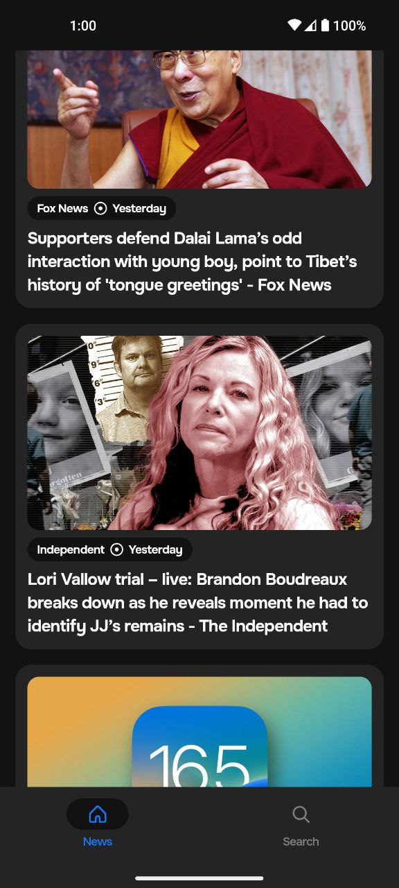
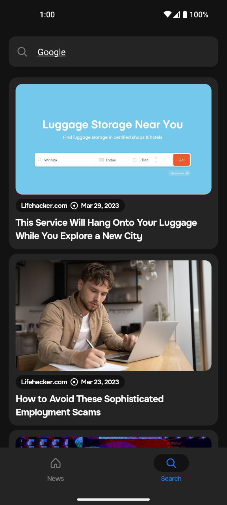
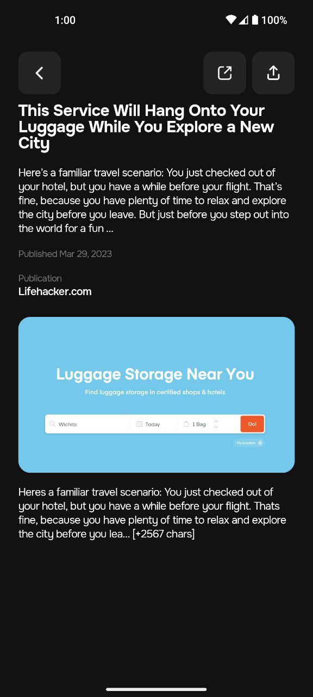
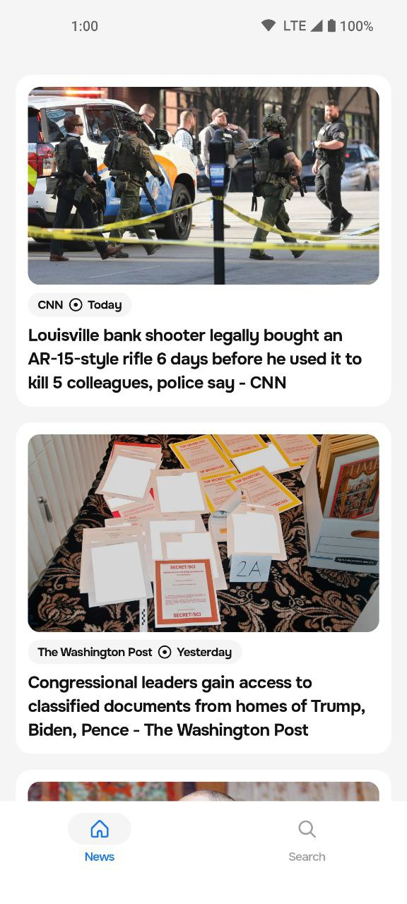
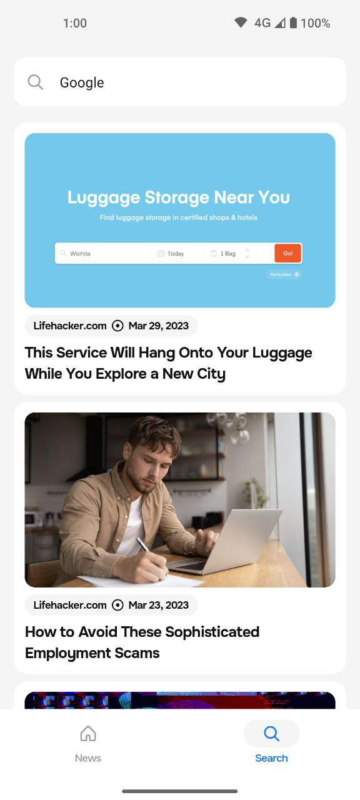
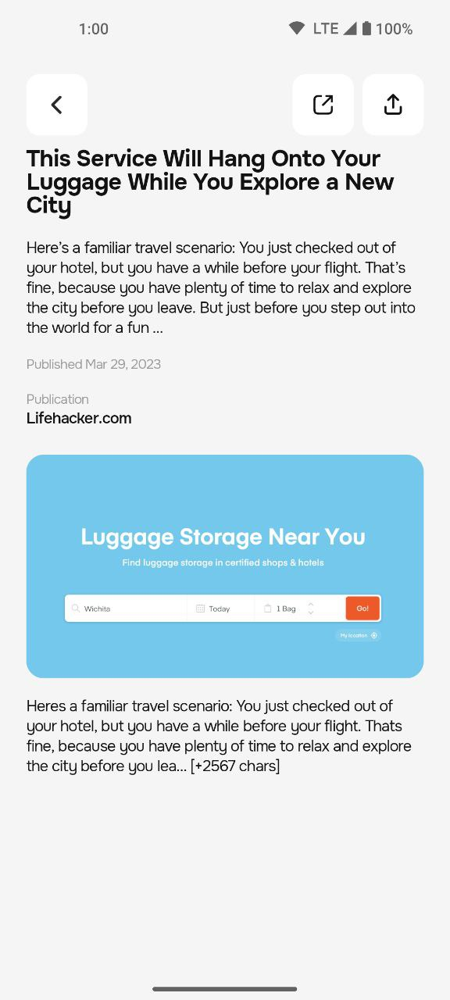
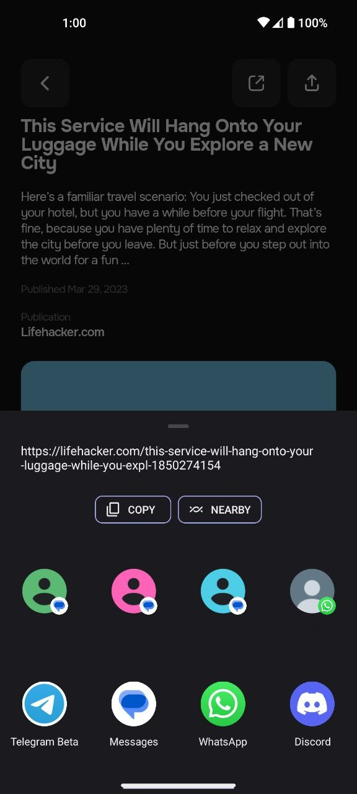

# News application sample, based on Jetpack Compose

## Screenshots

### Main screens

|                         Headlines                         |                         Search                         |
|:---------------------------------------------------------:|:------------------------------------------------------:|
|  |  |

|                         Article details                         |
|:---------------------------------------------------------------:|
|  |

### Theming

|                     Headlines (Dark)                      |                     Headlines (Light)                      |
|:---------------------------------------------------------:|:----------------------------------------------------------:|
|  |  |

|                     Search (Dark)                      |                     Search (Light)                      |
|:------------------------------------------------------:|:-------------------------------------------------------:|
|  |  |

|                     Article details (Dark)                      |                     Article details (Light)                      |
|:---------------------------------------------------------------:|:----------------------------------------------------------------:|
|  |  |

|              Forwarding an article               |
|:------------------------------------------------:|
|  |

## Topics
* DI
  - Dagger 2
* Navigation
  - Compose Destinations
* Architecture
  - Clean architecture
* Network
  - Retrofit
  - Moshi
  - OkHttp
* Paging
  - Paging 3
* Theming
  - Dark/Light themes
* Multi-module
* Compose Based UI
* Gradle configuration

## How to run
* Add `apiKey=<YourKey>` in `local.properties` file, for example `apiKey=72288ebc5b893cc92a76c701c6b700b6`
* Run -> Run `app`

## I'm on social media
* [VK](https://vk.com/ndynagn)
* [Telegram](https://t.me/gen_aa)